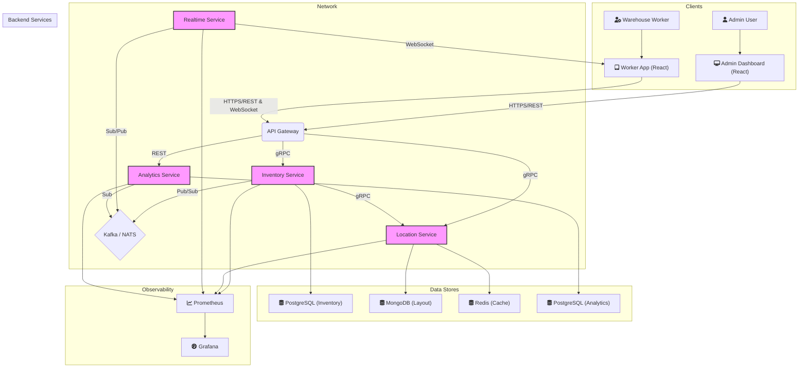

# Warehouse Management System (WMS) for Smart Shelves


[](https://github.com/m1i3k0e7/warehouse-management-system)

A modern, microservices-based Warehouse Management System designed to integrate with IoT smart shelves. This system provides real-time inventory tracking, optimized material placement, and operational guidance for warehouse staff, specifically tailored for a server manufacturing environment.

---

## Core Features

-   📦 **Real-time Inventory Tracking**: Seamless integration with IoT smart shelves to provide live updates on material check-in, check-out, and movement.
-   🗺️ **Intelligent Location Management**: Automatically suggests the optimal storage slot for new materials and maintains a digital twin of the warehouse layout.
-   🤖 **Optimized Pathfinding**: Calculates the most efficient route for warehouse staff to navigate from their current position to a target shelf, improving picking and stocking times.
-   📊 **Admin Dashboard**: A comprehensive web-based dashboard for managers to monitor the warehouse layout, inventory levels, and overall system health in real-time.
-   📈 **Data Analytics and Insights**: Ingests operational data to provide historical analysis, performance metrics, and actionable insights for warehouse optimization.
-   📱 **Worker Application**: A streamlined front-end application to guide staff through material handling tasks like placement, retrieval, and transfers.
-   ⚙️ **High-Availability Architecture**: Built on an event-driven, microservices architecture to ensure stability, scalability, and fault tolerance.

---

## System Architecture

This system utilizes a modern microservices architecture, with high-performance gRPC for inter-service communication and an API Gateway to expose a unified interface to front-end clients.



---

## Technology Stack

| Category          | Technology                                                              |
| ----------------- | ----------------------------------------------------------------------- |
| **Backend**       | Go, Node.js, Python (FastAPI, SQLAlchemy, Kafka-Python, APScheduler)    |
| **Frontend**      | React, JavaScript/TypeScript, CSS                                       |
| **API & Comms**   | gRPC, Protocol Buffers, REST, WebSocket                                 |
| **Databases**     | PostgreSQL, MongoDB, Redis                                              |
| **Messaging**     | Apache Kafka / NATS (Event-Driven Architecture)                         |
| **Infrastructure**| Docker, Kubernetes (K8s), Docker Compose                                |
| **Observability** | Prometheus, Grafana                                                     |

---

## Getting Started

### Prerequisites

-   Go (version 1.18+)
-   Node.js (version 18+)
-   Python (version 3.9+)
-   Docker & Docker Compose
-   `protoc` compiler
-   `kubectl` (for Kubernetes deployment)

### Installation & Launch

1.  **Clone the repository:**
    ```bash
    git clone https://github.com/m1i3k0e7/warehouse-management-system.git
    cd warehouse-management-system
    ```

2.  **Setup Environment Variables:**
    Create a `.env` file in the root directory by copying the example file.
    ```bash
    cp .env.example .env
    ```
    Update the `.env` file with your local configuration (database passwords, ports, etc.).

3.  **Launch Infrastructure:**
    Start all the necessary databases and services using Docker Compose.
    ```bash
    docker-compose -f infrastructure/docker/docker-compose.dev.yml up -d
    ```
    This will start PostgreSQL, MongoDB, and Redis containers.

4.  **Run Backend Services:**
    Navigate to each service directory and run the application.
    ```bash
    # Example for location-service
    cd services/location-service
    go mod tidy
    go run ./cmd/server/main.go
    
    # Example for analytics-service
    cd services/analytics-service
    pip install -r requirements.txt
    uvicorn src.main:app --reload
    ```
    Repeat for `inventory-service` and `realtime-service`.

5.  **Run Frontend Applications:**
    Navigate to each frontend app directory, install dependencies, and start the development server.
    ```bash
    # Example for admin-dashboard
    cd frontend/admin-dashboard
    npm install
    npm start
    ```
    Repeat for `worker-app`.

---

## Project Structure

```
.
├── api-gateway/        # Handles incoming HTTP requests and routes them to services
├── frontend/           # Contains all frontend applications (React)
│   ├── admin-dashboard/
│   └── worker-app/
├── infrastructure/     # Docker, K8s, Terraform, and other infra configurations
├── scripts/            # Deployment and setup scripts
├── services/           # Backend microservices
│   ├── analytics-service/  # Provides data analytics and insights (Python)
│   ├── inventory-service/  # Manages material data (Go)
│   ├── location-service/   # Manages physical layout and locations (Go)
│   └── realtime-service/   # Manages WebSocket connections (Node.js)
└── shared/             # Shared code, protobuf definitions, etc.
```

---

## Contributing

Contributions are welcome! Please feel free to submit a pull request.

1.  Fork the repository.
2.  Create your feature branch (`git checkout -b feature/AmazingFeature`).
3.  Commit your changes (`git commit -m 'Add some AmazingFeature'`).
4.  Push to the branch (`git push origin feature/AmazingFeature`).
5.  Open a Pull Request.

---

## License

This project is licensed under the MIT License. See the `LICENSE` file for details.